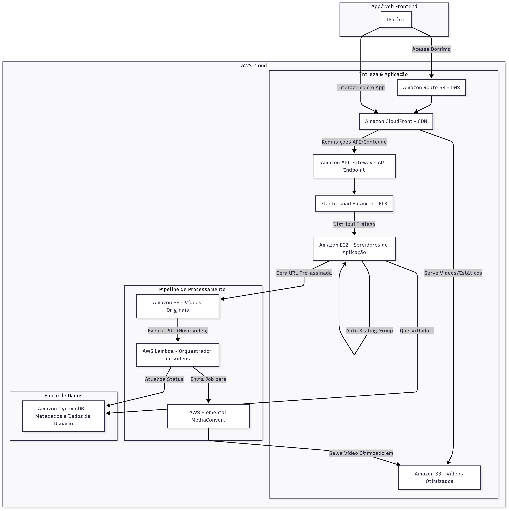
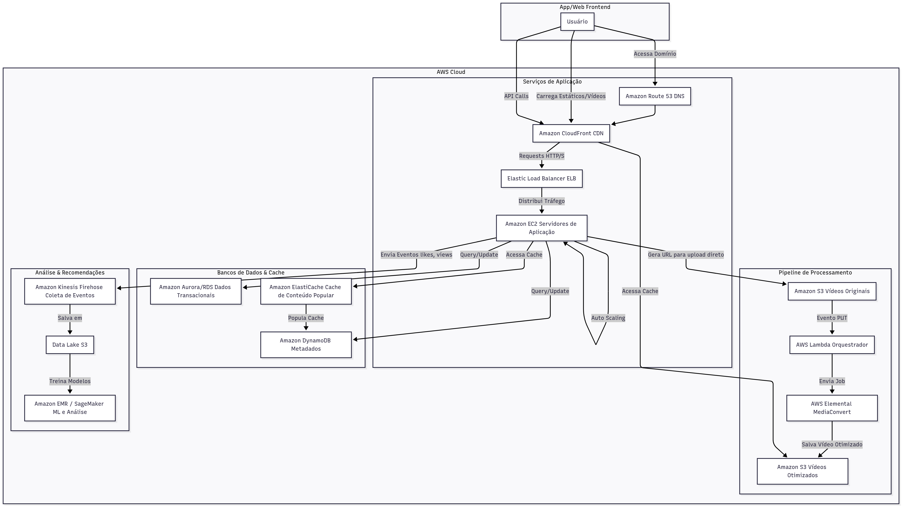

# Arquitetura AWS para um Serviço de Vídeos Curtos (TikTok)

Analisei o caso para a construção de uma arquitetura para um serviço de vídeos curtos como o **tiktok**.

Fiz minha tentativa de criação e depois consultei as IAs em busca de validação sobre a minha tentativa e também auxilio na construções de possíveis melhorias na arquitetura.

## Sumário
-  Conceitos de Arquitetura
- Serviços AWS Utilizados
    - Tópicos
    - Mais detalhes
- Tentativa 1
    - Parte 1: Whindersson postou vídeo no tiktok
    - Parte 2: Usuário assistiu o vídeo de Whindersson
- Melhorias com IAs
    - Fase 1: Arquitetura Simples e Serverless
    - Fase 2: Arquitetura Otimizada e Escalável
    - Fase 3: Arquitetura Completa
- Aprendizados

## Conceitos de Arquitetura
- **Serverless**: Refere-se a um modelo de computação em nuvem onde o provedor (como a AWS) gerencia a infraestrutura. O desenvolvedor foca apenas no código, sem se preocupar com servidores, capacidade, escalabilidade ou manutenção.

- **Auto Scaling:** Um conceito que permite que a capacidade de computação da sua aplicação se ajuste automaticamente em resposta à demanda. Em momentos de alto tráfego, novas instâncias são adicionadas para manter a performance. Quando a demanda cai, as instâncias são removidas para economizar custos.

## Serviços AWS Utilizados

### Tópicos
Amazon S3 → armazenamento dos vídeos originais e processados.

Amazon CloudFront → distribuição de vídeos via CDN para baixa latência.

Amazon EC2 + EBS → execução do backend principal e análise de dados.

AWS Lambda → funções serverless disparadas por eventos (ex.: upload de vídeo).

AWS MediaConvert → processamento/transcodificação de vídeos.

Amazon DynamoDB → banco de metadados (id, user, likes, status, URL).

Amazon Aurora/RDS → banco de dados relacional (usuários, histórico, transações).

Amazon Kinesis / SageMaker → coleta de eventos e recomendação personalizada.

Amazon S3 Glacier → arquivamento de vídeos com baixo acesso.

### Mais detalhes
- **Amazon S3 (Simple Storage Service):** Um serviço de armazenamento de objetos. É ideal para guardar ***arquivos estáticos, como vídeos, imagens e documentos***.

- **AWS Lambda:** Um serviço de computação serverless que executa seu código em resposta a eventos (como um upload de arquivo no S3).

- **Amazon API Gateway:** Ele atua como o "front door" para sua aplicação, gerenciando o roteamento e a comunicação com as funções Lambda ou instâncias EC2.

- **AWS Elemental MediaConvert:** Ele converte vídeos de um formato para outro (por exemplo, de um arquivo bruto para formatos otimizados para streaming em diferentes resoluções).

- **Amazon DynamoDB:** Um banco de dados NoSQL de chave-valor e documentos. Ele é projetado para aplicações que precisam de performance em escala, com latência de milissegundos para qualquer volume de tráfego. É ótimo para armazenar metadados ou dados de usuários.

- **Amazon Route 53:** Um serviço de DNS (Domain Name System) altamente disponível e escalável. Ele traduz nomes de domínio para endereços IP e pode direcionar o tráfego para os recursos da AWS.

- **Amazon CloudFront:** O serviço de CDN da AWS. Ele distribui conteúdo estático e dinâmico, como vídeos e arquivos de front-end.

- **Amazon EC2 (Elastic Compute Cloud):** Fornece capacidade de computação virtual (servidores) na nuvem. É o nosso "computador virtual" que funcionará como servidor.

- **Elastic Load Balancer (ELB):** Distribui o tráfego (exemplo: requisição à api) de entrada entre várias instâncias EC2.

- **Amazon Aurora / RDS (Relational Database Service):** Um serviço de banco de dados relacional. É ideal para dados transacionais que precisam de alta integridade e consistência.

- **Amazon ElastiCache (Redis):** Um serviço de cache em memória. Ele é usado para armazenar dados frequentemente acessados, reduzindo a latência de acesso ao banco de dados e a carga sobre ele.

- **Amazon Kinesis Firehose:** Um serviço que captura, transforma e carrega dados de streaming de forma confiável em um Data Lake (S3) ou em outros destinos de armazenamento.

- **AWS EMR (Elastic MapReduce):** Um serviço gerenciado de big data que simplifica a execução de frameworks como Apache Spark e Hadoop. É usado para processar grandes volumes de dados para análises ou machine learning.

- **Amazon SageMaker:** Um serviço que oferece um conjunto completo de ferramentas para construir, treinar e implantar modelos de machine learning em escala. É o motor por trás dos sistemas de recomendação.

## Tentativa 1 

### Parte 1: Whindersson postou vídeo no tiktok

**Fluxo da Requisição**
- O usuário faz o upload de um vídeo.
- A requisição é recebida pelo API Gateway.
- O API Gateway direciona a requisição para o Elastic Load Balancing.
- O ELB encaminha a requisição para uma das instâncias Amazon EC2 dentro do Auto Scaling Group.
- A instância EC2 processa o vídeo, utilizando o D-EBS para salvar dados maiores durante o processo.
- Após o processamento, o vídeo final é salvo no Amazon S3.
- O evento de upload no S3 aciona uma função AWS Lambda.
- O Lambda salva os metadados do vídeo no banco de dados e, em seguida, envia o vídeo processado de volta para o S3.
- O S3 pode, opcionalmente, mover vídeos antigos e raramente acessados para o S3 Glacier para economizar custos.

### Parte 2: Usuário assistiu o vídeo de Whindersson

Fluxo da Requisição
- O usuário faz uma requisição para acessar um vídeo.
- A requisição é recebida pelo API Gateway.
- O API Gateway a direciona para o Elastic Load Balancing.
- O ELB distribui a requisição para uma das instâncias EC2 no Auto Scaling Group.
- A instância EC2 acessa o banco de dados para obter os metadados do vídeo e a URL de acesso.
- Com a URL em mãos, a instância EC2 acessa o vídeo diretamente no Amazon S3.
- A instância EC2 retorna os metadados e o próprio vídeo ao usuário, via API Gateway.
- O S3 Glacier atua como um armazenamento de baixo custo para vídeos antigos. Se um vídeo for solicitado de lá, ele deve ser restaurado para o S3 para ser acessado.

## Fase 1: Arquitetura Simples e Serverless
Foco no upload, processamento e visualização de conteúdo.

### Componentes e Aplicação

### Reflexão
A arquitetura se assemelha bastante ao que construi, porém aqui na mesma arquitetura é apresentado os dois fluxos no mesmo diagrama. Fiz separado para facilitar o meu entendimento em cada fluxo. Acredito que esteja faltando alguns dados em partes intermediárias e observei algumas definições mais técnicas como "Evento PUT - Novo vídeo". Ele utiliza a mais o AWS ElementalMedia Converter para converter o vídeo em diferentes qualidades. Além disso, ele separa a lambda function da etapa "Dados" (que fiz de forma genérica) e cria a etapa "pipeline de processamento".

#### Fluxo do Processo
- **Upload**: O cliente solicita uma URL pré-assinada do S3 via API Gateway e Lambda. O vídeo é enviado diretamente para o S3, sem passar pelo servidor de aplicação.

- **Processamento:** O upload do vídeo no S3 aciona uma Lambda, que envia o arquivo para o MediaConvert. Após o processamento, uma nova Lambda atualiza o status do vídeo no DynamoDB.

- **Visualização**: O aplicativo busca os metadados no DynamoDB e as URLs dos vídeos no S3, permitindo a exibição do conteúdo ao usuário.

## Fase 2: Arquitetura Otimizada e Escalável (Intermediária)

#### Reflexão
Deixou claro o uso do DNS e deixou mais claro para mim o uso do banco de dados com o AWS elemental MediaConvert. Achei muito interessante o conceito de usar o CloudFront como facilitador de acesso a stream de vídeo no S3, era uma etapa que não tinha ficado tão clara na minha arquitetura.

#### Melhorias Aplicadas
Amazon Route 53: Como um serviço de DNS gerenciado, ele garante que os usuários sejam direcionados de forma eficiente para a sua aplicação.

Amazon CloudFront (CDN): A principal melhoria desta fase. O CloudFront atua como uma rede de distribuição de conteúdo (CDN), armazenando em cache os vídeos e as respostas da API em locais próximos aos usuários. Isso reduz drasticamente a latência de entrega e a carga sobre os servidores de origem.

Elastic Load Balancer (ELB) + Amazon EC2 com Auto Scaling: A lógica de negócio, antes em Lambda, migra para servidores EC2 com escalabilidade automática. Essa transição oferece mais controle sobre o ambiente de execução e é ideal para cargas de trabalho de tráfego contínuo e previsível, onde a latência de "inicialização a frio" do Lambda pode ser um problema. O ELB distribui o tráfego de forma inteligente entre as instâncias.

Fluxo do Processo
O fluxo de upload permanece similar, mas o de visualização é aprimorado. Agora, todas as requisições (vídeos e API) passam pelo CloudFront, que serve o conteúdo diretamente do cache, se disponível. Isso diminui a carga nos servidores de aplicação e garante uma experiência mais rápida para os usuários em qualquer lugar do mundo.

## Fase 3: Arquitetura Completa (Produção)

#### Reflexão
Nessa etapa eu queria conhecer uma arquitetura mais completa (eu sei que ainda tem muitas abstrações, mas para mim é suficiente por enquanto). Achei super interessante o jeito que a arquitetura lida com o cache e a etapa de análise e recomendações, duas partes super relevantes e que eu não tinha colocado na minha arquitetura.

#### Melhorias Aplicadas
Amazon Aurora / RDS: Um banco de dados relacional é adicionado para gerenciar dados mais complexos e transacionais, como perfis de usuário, que exigem maior integridade e consistência.

Amazon ElastiCache (Redis): Introduz um cache em memória para armazenar dados frequentemente acessados, como vídeos populares ou perfis de usuários. Isso reduz a latência de leitura para milissegundos, aliviando a carga sobre os bancos de dados primários (DynamoDB e Aurora).

Amazon Kinesis Firehose + AWS EMR / SageMaker: Esta é a principal melhoria para a inteligência de negócio. O Kinesis Firehose coleta eventos em tempo real (curtidas, visualizações, etc.) e os armazena em um data lake no S3. Os serviços EMR e SageMaker processam esses dados para treinar modelos de machine learning, que são a base para o feed de recomendações "Para Você", um recurso essencial para a retenção de usuários.

