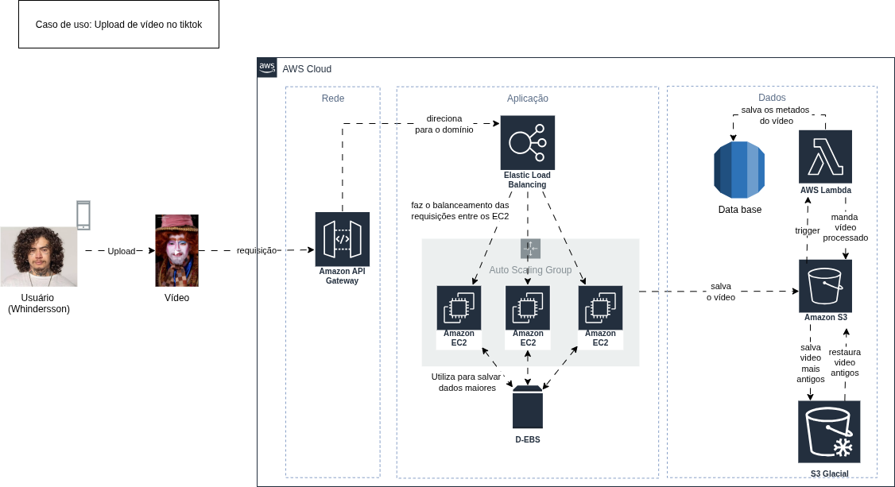
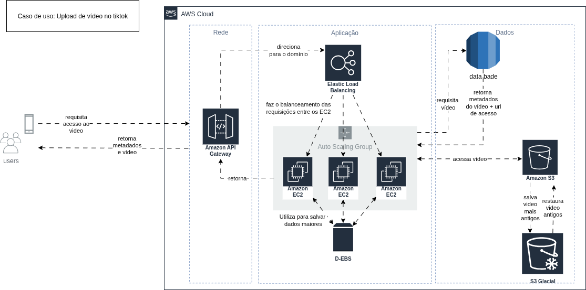
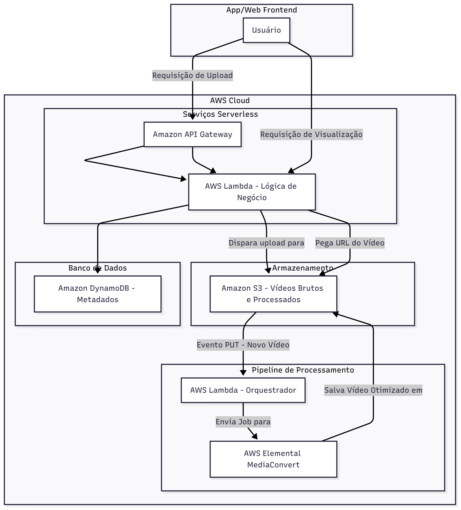
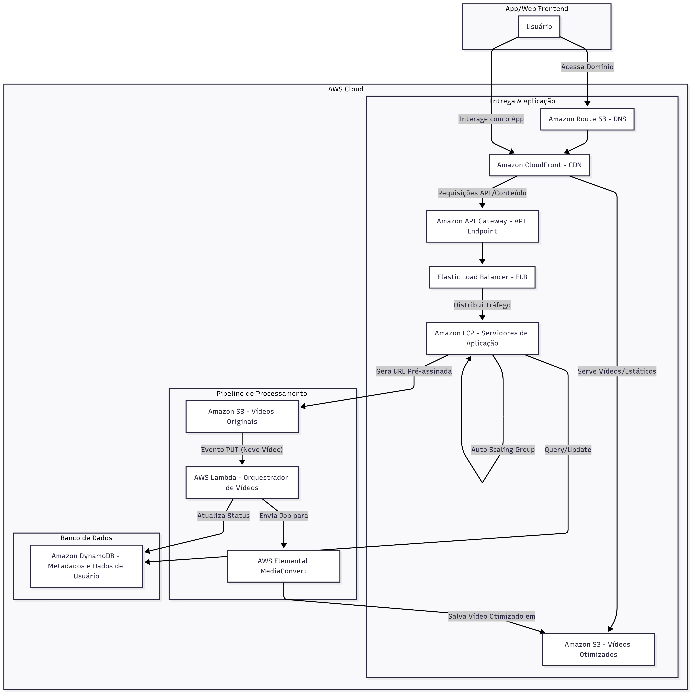
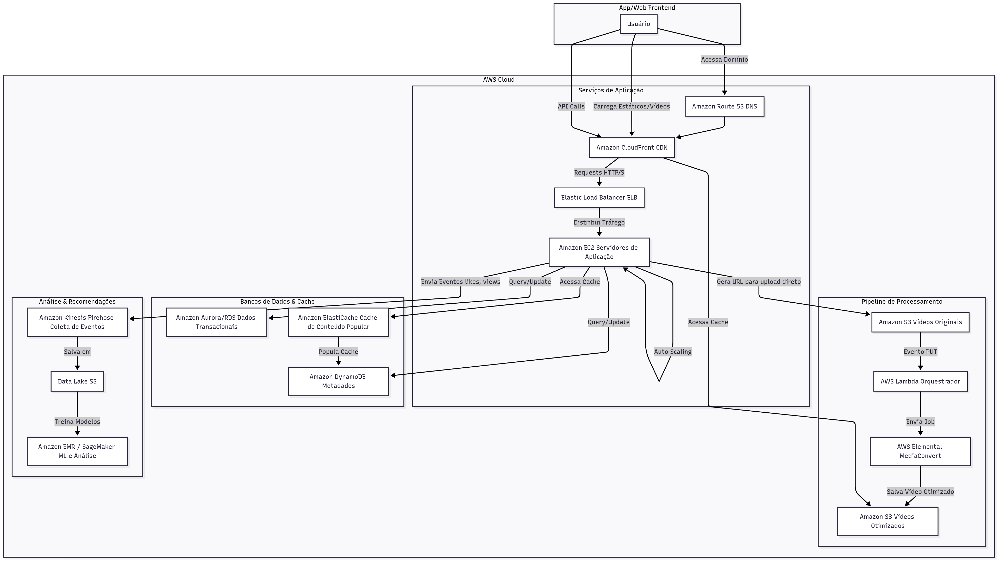

# aws-architecture-tiktok-case-study

## 📌 Resumo
Este repositório apresenta um estudo sobre arquitetura AWS para o 𝗕𝗼𝗼𝘁𝗰𝗮𝗺𝗽 𝗔𝗪𝗦 – 𝗖𝗼𝗱𝗲𝗚𝗶𝗿𝗹𝘀 𝟮𝟬𝟮𝟱, oferecido pelo Santander em parceria com a DIO e a Amazon.
Pensei na ideia de criar uma arquitetura **AWS** para um serviço de vídeos curtos como o **TikTok**.  
A proposta inclui diferentes fases de evolução da arquitetura: de uma solução simples e serverless até uma arquitetura completa e escalável de produção.

> ⚠️ Este material é apenas para estudo. Pode conter simplificações e não tem o objetivo de ensinar passo a passo ou servir como referência oficial.

### 

## Resultado Final dos diagramas
#### Upload de vídeo no tiktok

#### Stream de vídeo no tiktok

#### Arquitetura 1 

#### Arquitetura 2

#### Arquitetura 3

---

## 📂 Sumário
- [Conceitos de Arquitetura](#-conceitos-de-arquitetura)  
- [Serviços AWS Utilizados](#-serviços-aws-utilizados)  
- [Fluxos de Uso](#-fluxos-de-uso)  
- [Fases de Evolução](#-fases-de-evolução)  
- [Aprendizados](#-aprendizados)  

---

## 🔑 Conceitos de Arquitetura
- **Serverless** → Execução de código sem gerenciar servidores.  
- **Auto Scaling** → Ajuste automático da capacidade de acordo com a demanda.  

---

## ☁️ Serviços AWS Utilizados
- **Amazon S3** → armazenamento de vídeos.  
- **Amazon CloudFront** → CDN para baixa latência.  
- **Amazon EC2 + EBS** → backend e análise de dados.  
- **AWS Lambda** → funções disparadas por eventos (ex.: upload).  
- **AWS MediaConvert** → processamento de vídeos.  
- **Amazon DynamoDB** → metadados dos vídeos.  
- **Amazon Aurora/RDS** → dados relacionais.  
- **Amazon ElastiCache** → cache de vídeos e dados populares.  
- **Amazon Kinesis + SageMaker/EMR** → coleta de eventos e recomendações.  
- **Amazon S3 Glacier** → arquivamento de vídeos antigos.  
- **Amazon Route 53 + ELB + API Gateway** → entrada, roteamento e balanceamento.  

---

## ▶️ Fluxos de Uso

### Upload de vídeo
1. Usuário solicita upload → API Gateway.  
2. Backend gera URL pré-assinada para **S3**.  
3. Upload no S3 → dispara **Lambda**.  
4. **MediaConvert** processa vídeos em diferentes resoluções.  
5. Metadados são salvos no **DynamoDB**.  

### Visualização de vídeo
1. Usuário requisita vídeo → API Gateway.  
2. Backend consulta **DynamoDB/Aurora**.  
3. Vídeo é servido pelo **S3 via CloudFront**.  
4. Eventos (views, likes) são enviados para **Kinesis**.  

---

## 🏗️ Fases de Evolução

- **Fase 1 (Simples / Serverless)**  
  Upload e visualização básicos com **S3 + Lambda + DynamoDB**.  

- **Fase 2 (Otimizada / Escalável)**  
  Adição de **CloudFront, Route 53, EC2 e ELB** para melhor performance.  

- **Fase 3 (Completa / Produção)**  
  Introdução de **Aurora, ElastiCache, Kinesis, EMR e SageMaker** para suportar milhões de usuários e recomendações inteligentes.  

---

## 📘 Aprendizados
- O **S3** é central para armazenamento e distribuição de vídeos.  
- **Lambda + MediaConvert** tornam o pipeline de upload e processamento eficiente.  
- **CloudFront** é essencial para entrega global rápida.  
- Recomendações dependem de **coleta de eventos em tempo real** (Kinesis) + **machine learning (SageMaker)**.  
